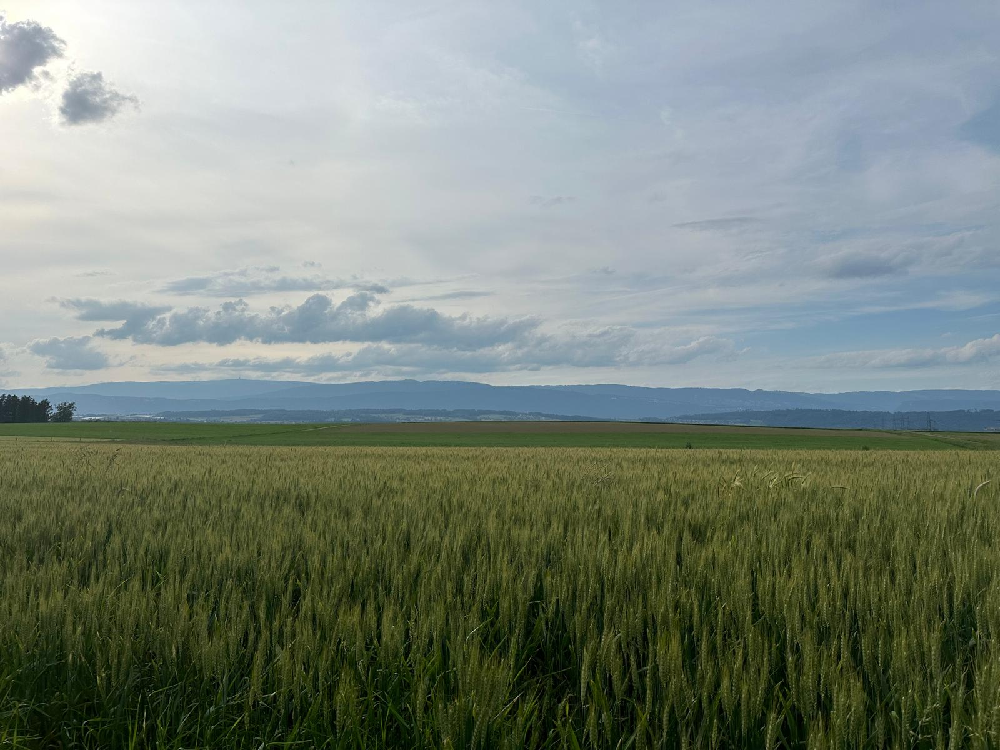
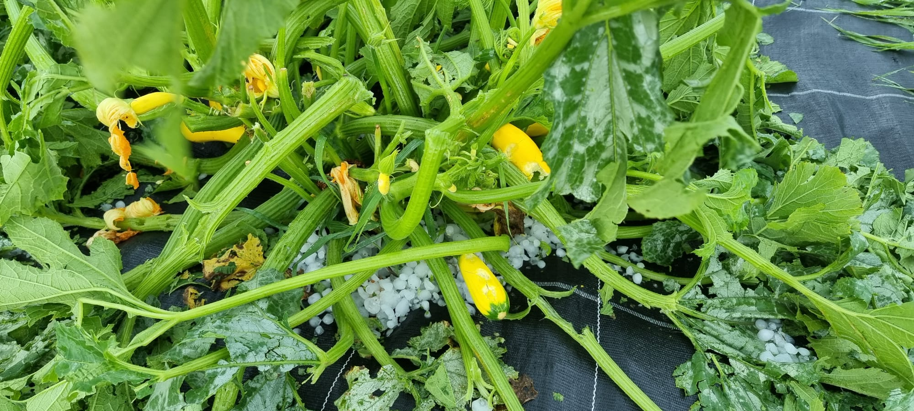

+++
title = "Landwirtschaft im Wandel"
date = "2024-06-18"
draft = false
pinned = false
tags = ["Klimawandel", "Deutsch", "Reportage", "Klimawandel"]
image = "whatsapp-image-2024-06-17-at-7.43.29-pm.jpeg"
description = "Dieser Artikel thematisiert die Notwendigkeit, dass sich sowohl Menschen als auch die Landwirtschaft an den Klimawandel anpassen müssen. Da Ackerland zunehmend unfruchtbar wird und Landwirte Schwierigkeiten haben, sich anzupassen, gerät die gesamte Lebensmittelversorgungskette in erhebliche Gefahr."
footnotes = "In der Fusszeile können zum Beispiel Bildquellen angegeben werden. Dieser Text ist abgetrennt durch eine Linie und etwas kleiner."
+++

**So wie sich Menschen dem Klima anpassen müssen, so muss es auch die Landwirtschaft. Durch die zunehmende Unfruchtbarkeit der Böden, gerät der Weg unserer Lebensmittel vom Feld bis zu uns in eine riskante Lage.**


Eine Reportage von Ayesha Ali und Lorenz Eggimann



<!--StartFragment-->

Seit sechs Generationen liegt das Herz und die Seele der Familie Brunner im Brunner Eichhof. An einem Abend gegen sieben Uhr betreten wir den Hof. Umgeben von schönen Feldern und Folienhäusern liegt der Hof vor uns im sanften Licht der untergehenden Sonne. Die Felder erstrecken sich in alle Richtungen und sind mit bunten Pflanzen bedeckt, die im sanften Wind tanzen. Die zwei Hunde der Familie streifen frei herum und scheinen ihre Freiheit zu genießen.     

Es war ein wunderschöner Tag hier oben, weit weg von den hektischen Geräuschen der Stadt. Der Hof befand sich neben einem Meer aus Feldern. 

Brunner empfängt uns mit einem herzlichen Lächeln, seine Hände noch leicht verschmutzt von der abendlichen Arbeit. Seine Tochter bietet uns frisch gepflückte Erdbeeren an – ein Zeugnis für die Ernte des Tages und die familiäre Beteiligung auf dem Bauernhof. 

Brunner ist Bio-Bauer, Vater von vier Kindern und Geschäftsführer auf seinem Hof. Das Motto seines Betriebs lautet: regenerativ, innovativ und adaptiv. Gemeinsam mit seinem Team entwickelt er fortlaufend neue, innovative Methoden für den Betrieb. Im Jahr 2010 übernahm Brunner den Betrieb. Er erinnert sich an eine Zeit, als das Klima noch ausgeglichener war. „Als ich den Betrieb übernahm, hat sich das Klima recht gut angepasst. Natürlich gab es einige Verschiebungen,“ erklärt er. Doch in den letzten fünf Jahren hat sich das drastisch verändert, es gibt nur noch Verschiebungen. „Heute haben wir jeden Sommer eine Hitzewelle. Das Extreme ist zum Normalzustand geworden,“ fügt er hinzu. Ein markantes Beispiel hierfür ist der 20. Juni 2021, als ein unerwartet heftiger Hagelsturm über die Felder zog. „Es hagelte wie verrückt, so etwas erlebt man normalerweise nur alle 20 bis 30 Jahre. Der Schaden war enorm,“ berichtet Brunner. Doch das war nicht das Ende der Herausforderungen. „Nach diesem Tag gab es in diesem Jahr keinen richtigen Sommer mehr,“ erinnert sich Brunner. Pflanzen, die normalerweise im August geerntet werden, erreichten nicht einmal bis Oktober ihre Reife. „Es wurde einfach nicht warm genug,“ klagte er. 

<!--EndFragment-->



### Der Teufelskreis der Landwirtschaft

<!--StartFragment-->

Die Auswirkungen des veränderten Klimas sind weitreichend. Wenn der Boden nass ist und man mit dem Traktor darüberfährt, wird der Boden zerstört, indem der Traktor den Boden zusammendruckt und verdichtet. Aufgrund der extremen Wetterveränderungen gibt es nur wenige ideale Tage für die Landwirtschaft, das Zeitfenster wird kürzer. Die Bauern und Bäuerinnen müssen in dieser kurzen Zeitspanne eine enorme Menge Land bewirtschaften. Dafür benötigen sie grosse Traktoren mit viel Leistung und einer hohen Flächenleistung. Diese schweren Maschinen verdichten jedoch den Boden, was dessen Fruchtbarkeit verringert. Ein weiteres Problem besteht darin, dass sich bei feuchtwarmen Bedingungen im Boden die Pilze auf dem Feld ausbreiten können. Das bedeutet, dass stärkere Maschinen benötigt werden, um die Pilze zu bekämpfen. Diese schädigen jedoch den Boden noch mehr. Das nennt Brunner ,,Den Teufelskreis der Landwirtschaft’’.

### Das Zentrale der Bodenqualität

Das Verschwinden verschiedener Anbaukulturen kann für viele Landwirte schwierige Folgen haben. Diese Folgen kommen in der Bodenqualität zum Vorschein.

Es gibt verschiedene Aspekte, die einen Boden zu einem guten Boden machen. Doch einer der wichtigsten Aspekte ist sicher der Humus im Boden. Wie auch bei den meisten die Vorratskammer ein wichtiger Nahrungsmittelspeicher ist, so ist es auch der Humus für die Pflanzen. Der Humus speichert Wasser und Nährstoffe, die den Pflanzen zur Verfügung stehen. Dies führt zu einem verstärkten Wachstum und einer besseren Nährstoffzusammensetzung der Pflanzen. Pflanzen, die in solchen Böden wachsen, sind nicht nur kräftiger, sondern auch nährstoffreicher und gesünder für den Konsumenten. Obwohl die Produktion von Pflanzen mit synthetischem Dünger und Pestizide wesentlich effizienter ist, ist das geerntete Gemüse deutlich ungesünder im Vergleich zu Pflanzen, die ohne synthetischen Dünger und Pestizide angebaut werden. Zum Großteil besteht der Humus aus Pflanzenresten, die von Bodenorganismen in mikroskopisch kleine Teile zerlegt werden. Auch die Reste von Tieren und Mikroorganismen werden letzten Endes in Humus umgewandelt. Pestizide töten nicht nur schädliche Insekten, sondern auch nützliche Organismen, die für den Aufbau und Erhalt des Humus unerlässlich sind. Der Verlust dieser Organismen führt zu einer Schwächung des Humus und somit zu einer verminderten Bodenfruchtbarkeit.

Mit Erde aus seinem eigenen Garten in den Händen erklärte Brunner wie unglaublich entscheidend eine vielfältige Bodenlebensgemeinschaft für die Gesundheit des Humus war. Man sah sogar wie sich kleine Bodenwesen in der Hand von Brunner bewegten. Der Boden vom Brunner enthielt ungefähr 3-4% Humus, was eigentlich sehr wenig war. Auf den Feldern von Brunner wären 10% Humusgehalt ideal, weil es somit in sich genug gut funktionieren würde.

> *,,Man kann sagen, dass es (Humus) wie eine Stadt ist. In dieser gibt es genügend Doktoren, genügend Schüler, genügend Polizisten usw. Es hat von allem, was es braucht, genug. Dann funktioniert die Gesellschaft. Und wenn jetzt ein Boden einfach plötzlich keine Strassen mehr hat, oder keinen Doktor, dann muss man immer von aussen helfen. Und ob man dann immer trifft, was es gerade braucht, ist eher schwierig. Es steckt viel Wissenschaft dahinter, aber sie muss auch am richtigen Zeitpunkt angewendet werden. Wie man sieht, gibt es viele Hürden. Aber wenn der Boden genug Humus hat, dann ist es dann relativ egal, wenn es mal richtig stark regnet, weil er das ohne grosse Schäden aufnehmen kann."*
>
> *Stefan Brunner, Gemüseproduzent*

Wir sitzen im Garten von Brunner, während sich die Sonne langsam dem Horizont nähert. Brunner zieht sein Messer aus der Tasche und schneidet bedächtig ein Stück Erde aus dem Boden seines Gartens. Er erklärt uns eine Lösung: Anstatt den gesamten Boden zu bearbeiten, entfernt man nur die oberste Schicht von etwa 5–10 cm, bearbeitet oder kultiviert sie und setzt sie wieder ein. Dadurch wird nur der oberste Teil des Bodens bearbeitet, und da der Humus bis zu 25–30 cm tief im Boden reicht, bleibt ein großer Teil des Humus erhalten.

### **Unter dem Teppich**

Mit der Zeit ändert sich auch unsere Ernährung. Die Bevölkerung wächst und es kommt zu Hungersnöten. Infolgedessen entstehen Herbizide, Pestizide und alle Arten von synthetischem Dünger. «Es war genial, eine wirtschaftliche Revolution», sagt Brunner. Nach dieser wirtschaftlichen Revolution gab es enorme Erträge; Lebensmittel wie Kartoffeln verbreiteten sich weltweit. „Ohne all diese Kunstdünger, Pestizide und Ähnliches hätten wir vermutlich nicht den Wohlstand, den wir jetzt haben. Es wäre nicht so schnell gegangen. Wir hätten es schon durch die Hungersnot geschafft, aber es wäre sicher nicht so schnell gegangen.“, stimmt Brunner zu.  

Doch das hatte seine Konsequenzen. Durch diese Pestizide und Dünger entstanden verschiedenste Krankheiten. Immer mehr und stärkere Düngemittel werden auf den Boden ausgebracht. „Das ist das Problem, das unter den Teppich gekehrt wird. Und unter dem Teppich, wo man es nicht sieht, wird das Problem grösser und grösser“, sagt Brunner. Alles hängt zusammen: unser Klima, der Boden, unsere Lebensmittel und unsere Gesundheit. Zurückzugehen wird schwierig. Wir sind an einem kritischen Punkt angelangt, wir müssen handeln, bevor es zu spät ist.

Deshalb fragen sich viele, ob Bio-Anbau die Lösung ist. Laut Brunner ist immer wieder von einem Biobauern oder einer Biobäuerin zu hören, der oder die ein Burnout hatte. Um Bio zu produzieren, sind riesige Anfangsinvestition nötig und es braucht mehr Zeit als bei konventionellen Produkten. Konventionelle Produkte haben auch deutlich niedrigere Kosten und höhere Erträge, was eine stetige Versorgung sicherstellt.

Das ist so, weil der konventionelle Anbau synthetische Chemikalien verwendet, um das Wachstum zu fördern und die Pflanzen zu schützen. Der biologische Anbau vermeidet synthetische Chemikalien und setzt stattdessen auf natürliche Substanzen und Verfahren. Das führt dazu, dass Bio-Obst und -Gemüse höhere Nährstoffwerte und geringere Mengen an giftigen Metallen aufweisen. Viele entscheiden sich aber lieber für das Konventionelle, da es weniger kostet und eine längere Haltbarkeit hat aufgrund von Konservierungsstoffen und anderen Behandlungen. Bioprodukte verderben daher schneller. Allerdings ist von grösster Bedeutung, dass biologische Anbaumethoden die Nährstoffqualität steigern, die Bodengesundheit fördern, indem sie den Humusanteil erhöhen, Wasser sparen und die biologische Vielfalt unterstützen.

```
Permakultur
Permakultur schafft nachhaltige Systeme, die der Natur nachempfunden sind. 
Diese Systeme unterstützen das Gedeihen von Pflanzen, Tieren und Menschen, ohne
der Umwelt zu schaden. Durch effiziente Nutzung von Ressourcen, Reduzierung von
Abfall und die Pflege von Boden und Wasser fördert Permakultur die ökologische 
Gesundheit. Sie zielt darauf ab, unsere heutigen Bedürfnisse zu erfüllen, 
während wir gleichzeitig einen gesunden Planeten für kommende Generationen 
sichern. In der Permakultur wird darauf Wert gelegt, dass manuelle Arbeit so 
weit wie möglich genutzt wird. Permakultur lehrt uns, im Einklang mit der Natur
zu leben und so eine nachhaltige Welt zu gestalten.
```

### **Sicht in die Zukunft**

Laut Brunner ist die Permakultur die Lösung für die aktuellen Herausforderungen in der Landwirtschaft. Der Schwerpunkt dieser nachhaltigen Praxis liegt auf der Regeneration und Bodenfruchtbarkeit, die für die langfristige landwirtschaftliche Produktivität von entscheidender Bedeutung sind.

Er erklärt, dass jeder Kassenzettel von Lebensmitteln wie ein Stimmzettel ist. Das, was nachgefragt wird und genug Geld bekommt, wird natürlich produziert. Das Problem dabei ist, dass beim Einkauf von Lebensmitteln nicht darauf geachtet wird, was sie enthalten, wie gesund sie sind oder wie viele Nährstoffe sie enthalten. 

Als Brunner die Lebensmittel ablieferte, musterte der Kontrolleur jedes Stück mit kritischem Blick. Alles Unperfekte wurde sofort aussortiert. „Preisabschläge“, murmelte der Kontrolleur, während er fehlerhafte Kartoffeln beiseitelegte. Jeder Makel bedeutete weniger Geld für Brunners harte Arbeit.

> *"Nie hat jemand hineingebissen. Wie viele Nährstoffe dort drin sind, interessiert niemanden im Großhandel. Es ist nicht relevant für den Preis."* 
>
> *Stefan Brunner, Gemüseproduzent Eichhof*


Aus diesem Grund sind die Meisten Bauern darauf angewiesen schöne Lebensmittel zu produzieren, da sie überleben müssen. Konventionelle Lebensmittel werden weiterhin produziert und die Bodenfruchtbarkeit wird weiterhin sinken. Kurz gesagt, ist es unerlässlich, dass sich die Art und Weise der Preisermittlung ändern muss. Auch ist es wichtig, dass die Bauern gebildet werden. Es gibt zu wenige Personen, die wissen, wie Permakultur funktioniert. 

Brunner ist überzeugt davon, dass es realistisch ist, anzunehmen, dass Permakultur und regenerative Landwirtschaft eines Tages in der Schweiz einen bedeutenden Platz einnehmen könnten. Für Brunner ist die Permakultur nicht nur eine Methode, sondern eine Vision einer besseren, nachhaltigeren Zukunft. 

Wenn alles manuell erledigt werden muss, wird es zwangsläufig länger dauern. Die Zukunft dieser Praktiken hängt von der Verfügbarkeit von Permakultur freundliche Maschinen ab, da zu wenig Personen darin geschult sind. Wir müssen viel investieren, um permakulturfreundliche Maschinen zu entwickeln und verfügbar zu machen. Brunner ist überzeugt, dass bei steigender Nachfrage nach Bioprodukten auch die Investitionen in die Bio-Landwirtschaft zunehmen würden. Dies würde die Chancen für die Verbreitung der Permakultur erheblich verbessern. 

 Brunner sieht eine Welt vor sich, in der nachhaltige Praktiken nicht nur eine Option, sondern eine Notwendigkeit sind. Brunners Leidenschaft und Hoffnung sind ansteckend. Es liegt an uns, diesen Traum zu verwirklichen und eine bessere, gesündere Welt für die kommenden Generationen zu schaffen.

Es war merklich kälter geworden, als wir den Brunner Eichhof verließen, umgeben von einer ruhigen, nachdenklichen Atmosphäre. Das warme Licht der untergehenden Sonne tauchte die Felder in ein sanftes Leuchten, während wir über die tiefgründigen Erkenntnisse von Stefan Brunner und die Herausforderungen der Landwirtschaft nachdachten. Mit einem reichen Wissensschatz zu diesen Themen und einem tieferen Verständnis vom Boden kehrten wir nach Hause zurück und ließen unsere Erfahrungen auf uns wirken.

<!--EndFragment-->

## Überschrift 2eme-font:minor-latin;

```
mso-font-kerning:1.0pt;
mso-ligatures:standardcontextual;
mso-ansi-language:EN-US;
mso-fareast-language:EN-US;}
```

</style>
<!\\\\\\\\\\\\[endif]-->

<!--StartFragment-->

Dies ist die Überschrift 2 (H2).

Die Überschrift 3 ist nicht mehr im Menu verfügbar. Wenn man sie verwenden will, muss man in den `Markdown`-Modus wechseln und dort eine Überschrift mit drei Hastags einleiten: `### Überschrift 3`

#### Überschrift 4

Auch Überschrift 4 muss im `Markdown`-Modus erstellt werden: `#### Überschrift 4`

## Weitere Textformatierungen

Am besten einfach alle Formatierungsmöglichkeiten in der Toolbar von `Inhalt` mal ausprobieren.

### Fett und Kursiv

Natürlich gibt es auch **fett** und *kursiv*.

### Links

[So können Links angegeben werden](https://www.lilo.blog). Wenn man in den `Markdown`-Modus wechselt, sieht man auch, welcher Link hinterlegt worden ist.

### Zitate

> «Zitate können hervorgehoben werden.»
>
> *Autor mit [Link zur Quelle](https://www.lilo.blog)*

Die Quellenangabe muss *kursiv* geschrieben werden, damit sie als Fusszeile erkannt wird.

### Liste

So sieht eine Liste aus:

* Nam de isto magna dissensio est.
* Mihi, inquam, qui te id ipsum rogavi?
* Haec et tu ita posuisti, et verba vestra sunt.
* Idem fecisset Epicurus, si sententiam hanc, quae nunc Hieronymi est, coniunxisset cum Aristippi vetere sententia.

### Nummerierte Liste

Und so eine nummerierte Liste:

1. Nam de isto magna dissensio est.
2. Mihi, inquam, qui te id ipsum rogavi?
3. Haec et tu ita posuisti, et verba vestra sunt.
4. Idem fecisset Epicurus, si sententiam hanc, quae nunc Hieronymi est, coniunxisset cum Aristippi vetere sententia.

## Bilder

Bilder werden mit dem `+`-Symbol eingefügt.


**Empfehlung für Bilder**: Meist empfiehlt sich, ein Bild ganz zuoberst im `Inhalt`-Feld einzufügen. Zusätzlich sollte man dieses auch im `Bild`-Feld angeben, damit es in der Blogübersicht erscheint.

### Tipps zu Bildgrössen

Ein Richtwert für Bilder ist, dass diese wenn möglich nicht grösser als `400kb` sein sollten. Man kann sie so verkleinern, dass die Breite höchstens `1200px` gross ist. Dies ist für die meisten Bildschirme mehr als genug.

### Bildunterschrift

Wenn bei einem Bild ein `ALT TEXT` erfasst wird, so wird dieser als Bildunterschrift im Artikel angezeigt.

## Horizontale Linie

Eine Horizontale Linie kann man entweder durch ein `<hr>` einfügen oder indem man im `Markdown`-Modus drei Striche `---` einfügt. So sieht die Linie aus:

- - -

## Lead


Oft haben Artikel unterhalb des Haupttitels einen einführenden Lead, der etwas grösser dargestellt wird.


``\
Ein Lead steht zwischen zwei solchen Blöcken.\
``

## Kasten


In dieser Box können Texte, Bilder, Videos oder andere Inhalte dargestellt werden.


``\
Der Inhalt einer Box muss wie hier von zwei Blöcken umgeben werden.\
``


Wird ein Titel angegeben, so kann die Box ausgeklappt werden.

Dies eignet sich auch für längere Inhalte.


Auch Bilder können in eine Box gepackt werden.


``\
Wird ein Titel angegeben, so kann die Box ausgeklappt werden.\
``

## Video, Audio und andere Medien einbetten

Es kann auch `HTML-Code` eingefügt werden. Manchmal geht dies etwas einfacher, wenn man dazu in den `Markdown`-Modus wechselt.

Damit können zum Beispiel Filme, Audiodateien oder Karten eingebettet werden. Meist sind auf den entsprechenden Plattformen (YouTube, Vimeo, Google Maps, etc.) entsprechende Code-Ausschnitte vorbereitet, die man direkt in den Blog einfügen kann. Am besten auf der jeweiligen Plattform nach einem Knopf für `embed` oder `share` suchen.

Bei Videos ist es ideal, wenn sie sich automatisch **an die Bildschirmgrösse anpassen**. Dies geht am einfachsten mit den hinterlegten YouTube- und Vimeo-Codes:

### YouTube einbetten

Einbetten von YouTube-Videos mit dem Code: ``

(Die `video_id` steht bei jedem YouTube-Video in der Browser-URL.)



### Vimeo einbetten

Einbetten von Vimeo-Videos geht mit dem Code: ``



### Code und Code-Blöcke

Mit dem Code-Symbol `<>` können Wörter auf `diese Art` hervorgehoben werden. Dies wird zum Beispiel für Tastenkombinationen wie `ctrl+s` oder für `Programmiercode` verwendet. Auch Math-Formeln können so ausgedrückt werden: `y = mx + b`.

Für längere solche Abschnitte verwendet man am besten das Code-Block-Symbol. Damit wird ein solcher Block erstellt:

```
const sun1 = "sun" + "il";
const sun2 = "su" + "n" + "il";
sun1 === sun2;
```

## Spass haben

😀 Viel Spass mit deinem Blog!